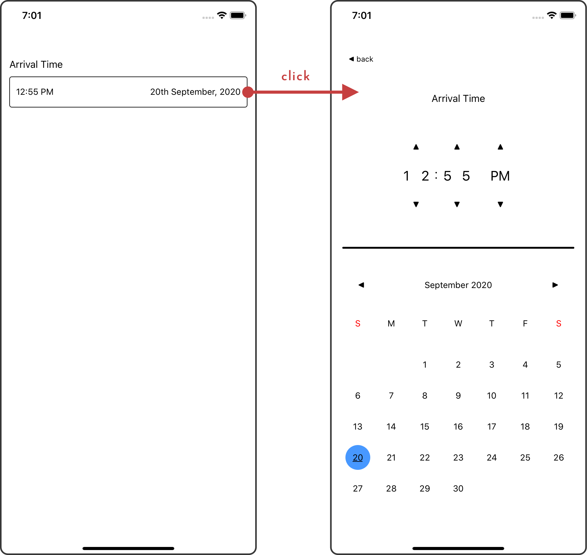

# @super-formal/rn-date-time-input

DateTime input component for react-native.

<p align="center">
  
</p>

## Index

- [Installation](#installation)
- [Basic Usage](#basic-usage)
- [The `DateTimeInput` Component](#the-date-time-input-component)
  - [`style` prop](#dateTimeInput-style)
  - [`label` prop](#dateTimeInput-label)
  - [`value` prop](#dateTimeInput-value)
  - [`hasError` prop](#dateTimeInput-hasError)
  - [`onActive` prop](#dateTimeInput-onActive)
  - [`onChange` prop](#dateTimeInput-onChange)

## Installation

Using npm:

```
npm i --save @super-formal/rn-date-time-input
```

Using yarn:

```
yarn add @super-formal/rn-date-time-input
```

## Basic Usage

After installing the package you can use it in your React components as follows:

```
import DateTimeInput from '@super-formal/rn-date-time-input';

const [arrivalTime, setArrivalTime] = useState(Date.now());

// inside your render() function
<DateTimeInput
  label="Arrival Time"
  value={arrivalTime}
  onChange={val => setArrivalTime(val)}
/>
```

## The `DateTimeInput` Component

### <a id="dateTimeInput-style"></a> `style` prop

`{Object<propName: String, propValue: any>}` - optional - At the moment, the only customizable style property is `marginBottom`.

### <a id="dateTimeInput-label"></a> `label` prop

`{String}` - optional - The label that describes what the datetime value signifies. Defaults to `""`.

### <a id="dateTimeInput-value"></a> `value` prop

`{Integer}` - required - The unix timestamp (in milliseconds) of the currently selected datetime value.

### <a id="dateTimeInput-hasError"></a> `hasError` prop

`{Boolean}` - optional - Whether the date time input is in an error state or not. Defaults to `false`.

### <a id="dateTimeInput-onActive"></a> `onActive` prop

`{Function<>}` - optional - A callback that is called when the input is selected (before showing the datetime selector modal).

### <a id="dateTimeInput-onChange"></a> `onChange` prop

`{Function<Integer>}` - required - A callback that is called when the selected value is changed. It has the signature `(Integer newValue) => {...}`, where the `newValue` is the new unix timestamp (in milliseconds) for the newly selected datetime value.
